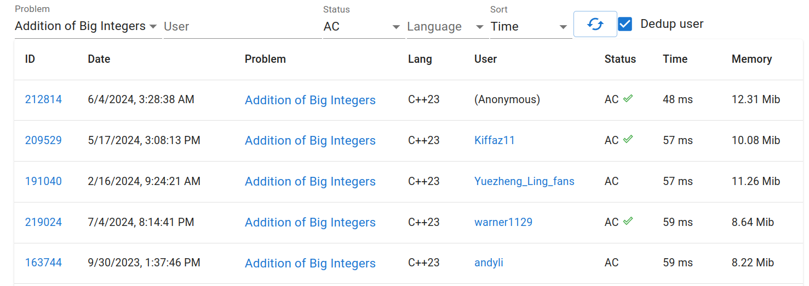

*\*Under a few conditions. But I have proof, trust me.*

I was interviewing for a Software Engineering Intern position at a decent-sized company in Vietnam. Having passed the in-person interview with flying colors, I was ready to tackle the final take-home assignment.

And surprisingly enough, it was to implement a [Big Integer](https://en.wikipedia.org/wiki/Arbitrary-precision_arithmetic) expression calculator that:

- Supports additions, subtractions, multiplications and parentheses;
- Supports modulo (bonus feature, so I skipped that);
- Minimizes memory footprint.

The simplest implementation for Competitive Programming (in most cases) is from [kc97ble](https://sites.google.com/site/kc97ble/2-ki%E1%BB%83u-d%E1%BB%AF-li%E1%BB%87u/bignum-v%E1%BB%9Bi-c%C3%A1c-ph%C3%A9p-to%C3%A1n). However, it doesn't deal with negative numbers. Another powerful and versatile snippet I have used in the past is from [I_love_Hoang_Yen](https://github.com/ngthanhtrung23/ACM_Notebook_new/blob/master/Math/bigint.h), which ended up being the inspiration for my implementation.

In this blog, I will be writing about Big Integer itself. For more details on expression parsing, please see the `README` of the repository.

[Here is the repository of my code.](https://github.com/jalsol/bigint)

## Algorithm

The algorithm is in fact the easiest part. If you have ever gone through elementary school, you should already know how to add, subtract, and multiply two numbers digit-by-digit. Yes, that's our algorithm.

Since our number is so big, we obviously cannot store them in an `int` or `long long`. We will read our input as strings first, then convert the strings into `BigInt`s later.

To prepare for our algorithm, you may want to store all digits into an array for convenience. For now, I am using `std::vector` as array (but will replace it with something else later).


```cpp
std::vector<int> get_digits(std::string_view number) {
    std::vector<int> buffer(number.size());

    for (std::size_t i = 0; i < number.size(); ++i) {
        buffer[i] = number[number.size() - i - 1] - '0';
    }

    return buffer;
}

const auto a = get_digits("69420"); // {0, 2, 4, 9, 6}
```

The digits are actually reversed, but that's OK. That's my intention. It will make calculation easier and more efficient:

```cpp
auto a = get_digits("69420"); // {0, 2, 4, 9, 6}
auto b = get_digits("1269420"); // {0, 2, 4, 9, 6, 2, 1}

// now b has more digits than a
// for example, to add each digit one by one,
// let's make both of them have the same

for (std::size_t i = 0; i < (b.size() - a.size()); ++i) {
    a.push_back(0);
}

// a = {0, 2, 4, 9, 6, 0, 0}
// b = {0, 2, 4, 9, 6, 2, 1}
// same length
```

Because we are using `std::vector`, pushing to the back is much faster than pushing to the front. Other data structures will have some trade-offs that aren't worth it.

Adding (without carry) will be a simple:

```cpp
std::vector<int> result(b.size());

for (std::size_t i = 0; i < b.size(); i++) {
    result[i] = a[i] + b[i];
}
```

Support for carrying should be trivial. You can come up with a solution or read my code.

## Internal storage

This is where things get a bit more interesting.

### Digits

In the algorithm, we do calculation in base 10, which means a calculation involves two one-digit numbers at a time. That's pretty wasteful - computers can do more than that. We can do calculation in base 10^9. This means that for each calculation, we are calculating two nine-digit numbers at a time.

In the original `get_digits`, we only extract one digit at a time. Let's do 9.

```cpp
std::vector<int> get_digits(std::string_view number) {
    std::vector<int> result;

    // reserve int(ceil(number.size() / 9))
    result.reserve((number.size() + 9 - 1) / 9);

    auto convert_range_to_num = [&](std::size_t head, std::size_t tail) {
        long long num = 0;
        for (auto i = head; i < tail; ++i) {
            num = 10 * num + (number[i] - '0');
        }
        return num;
    };


    auto tail = number.size();
    for (; tail >= 9; tail -= 9) {
        const auto head = tail - 9;
        result.push_back(convert_range_to_num(head, tail));
    }

    if (tail != 0) {
        result.push_back(convert_range_to_num(0, tail));
    }

    return result;
}
```

If you can't understand the code right now, it's fine. Basically, here's its usage:


```cpp
const auto a = get_digits("834752895720389374092984457");
// a = {92984457, 720389374, 834752895}
```

From right to left, it collects every 9 characters and makes that a number.

Why 9 characters? 10^9 fits an `int` and (10^9) * (10^9) fits a `long long`. We can't use more than 9 characters due to the risk of overflowing/underflowing. We can use less, but it's neither safer nor faster. This is why 10^9 and 10^18 can often be seen in Competitive Programming and/or interview problems.

### `basic_string` and Small String Optimization (SSO)

This is another trick up in my sleeves.

So far, I have been using `std::vector`. However, `std::string`s (or `std::baisc_string`s to be precise) are implemented a bit differently.

A dynamic array usually contains a pointer to the allocated data, a size and a capacity:

```cpp
// Total: 24 (bytes)
struct Vector {
    long long* data;        // 8 bytes
    std::size_t capacity;   // 8 bytes
    std::size_t size;       // 8 bytes
};
```

Let's say, my `Vector` only has 1 element:

```cpp
// Total: 32 bytes
long long* ptr = new long long[1];  // 8 bytes
auto vec = Vector { ptr, 1, 1 };    // 24 bytes
```

32 bytes to store 1 `long long`. That is also wasteful, and people have found a way to optimize it: Small String Optimization.

```cpp
// Total: 24 bytes
struct Vector {

    // Total: 24 bytes
    struct Large {
        int* data;              // 8 bytes
        std::size_t capacity;   // 8 bytes
        std::size_t size;       // 8 bytes
    };

    // Total: 24 bytes
    struct Small {
        long long buf[sizeof(Large) / sizeof(long long) - 1];
        std::size_t size;
    }

    union {
        Large large;
        Small small;
    };
}
```

The trick lies in `union`. When the array is small, we use the memory that should have been for `data` and `capacity` for the array itself. We don't waste extra memory, and we don't create any dynamic allocation. SSO saves memory and saves time.

In practice, most of the numbers we deal with are small. And because they are small, SSO really offers a great performance boost. SSO is implemented in `std::basic_string` by major compilers (GCC, Clang, MSVC). What's even better is that you can use it in-place of `std::vector`.

## Other implementation details

### `long long`

Each "digit" stores 9 characters at a time. `int` technically should be enough, but overflows do happen during calculation. That's why I chose `long long` as the element type for the internal storage.

### `constexpr`

I also wanted to try making my `BigInt` class `constexpr`-friendly. Well yes it is, but since being `constexpr`-friendly doesn't mean being `constexpr` (you can only use it as an intermediate for calculation, not the returning container). I read somewhere that the C++ committee rejected the idea of turning heap allocation `constexpr`.

## Actual result

### Addition & Subtraction

[This submission](https://judge.yosupo.jp/submission/212814) on [yosupo's Library Checker](https://judge.yosupo.jp/submissions/?problem=addition_of_big_integers&order=%2Btime&status=AC) is currently the fastest implementation of big integers (as of July 27, 2024), outperforming other implementations without any complex optimizations (48ms vs. 57ms).



### Multiplication

Well, I use the kid method, what do you expect? [It got Time Limit Exceeded](https://judge.yosupo.jp/submission/212882). The solution is to use FFT and/or Karatsuba. I was too lazy, and the problem statement said nothing about execution speed, so I settled with the simplest trick.

### Did I actually get the internship?

No(t yet).

I revealed that I would go to Singapore for an exchange semester in NUS. They were actually cool with that and told me I could go onboard after the semester ends.

One remark they made about me was that I "have good fundamentals, but lack in web development experience". I can't blame them. I can do webshit, I just chose to do other interesting projects.

