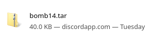
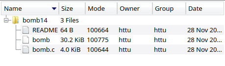
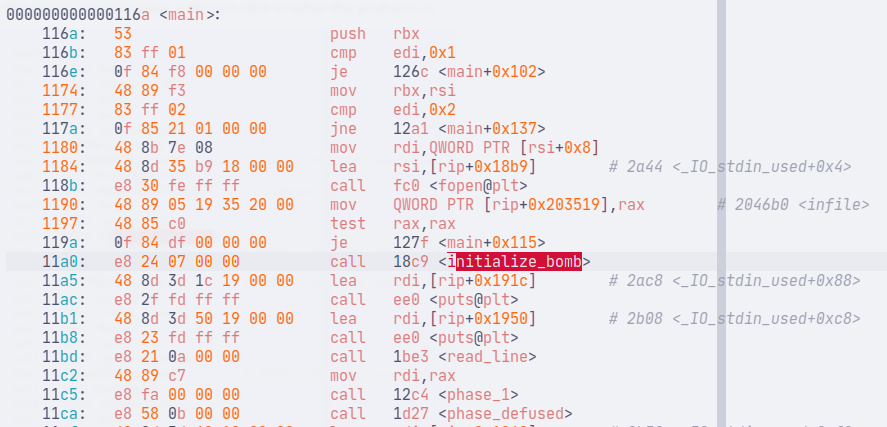
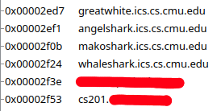
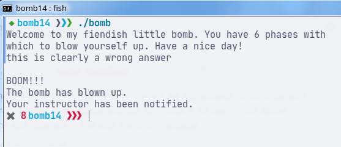
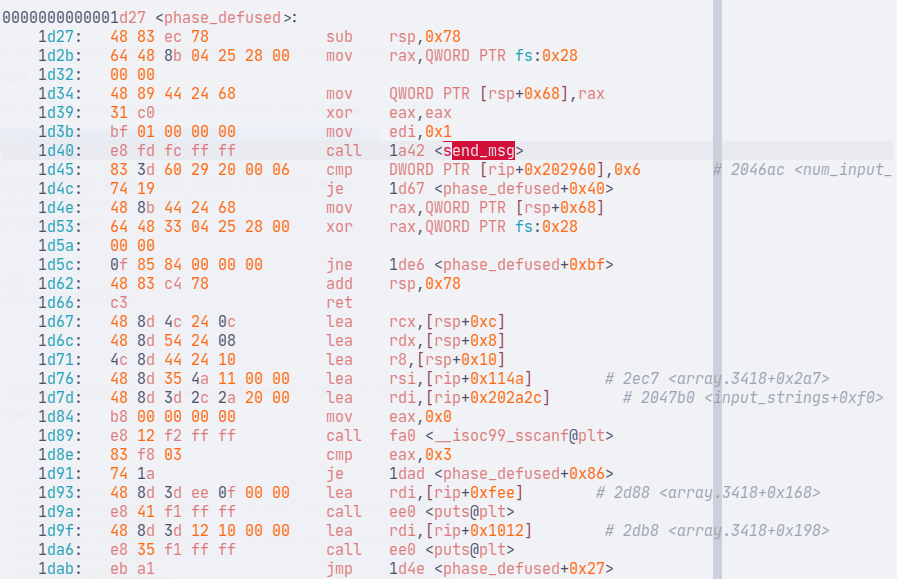
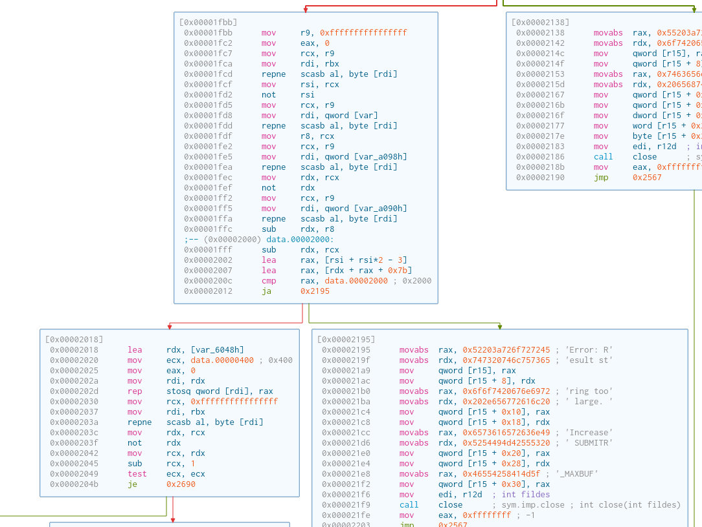
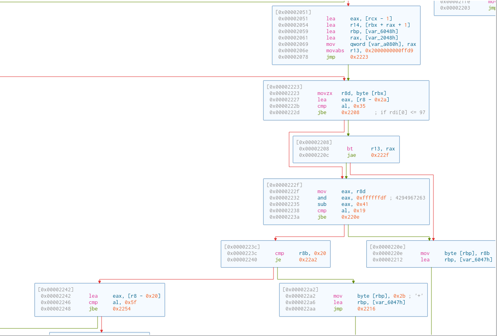
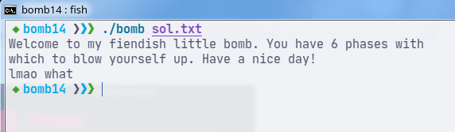
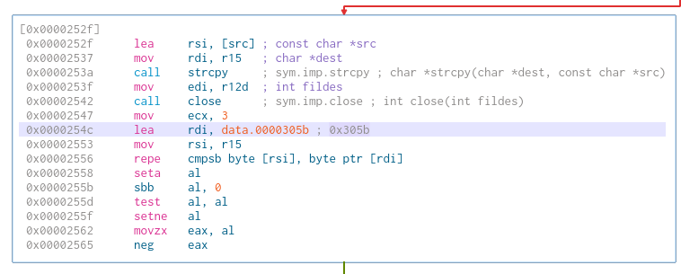

## Introduction

CMU is known for having arguably the best Introduction to Computer Systems course in the world. Its course book (CS:APP) and its lab exercises are also brought into similar courses in universities around the world.

## The normal process of the lab

This time, we did the bomb lab exercise, where we, as a team, had to reverse-engineer the executable and try to find out the correct inputs. If a wrong input is given, the program "explodes".

### Installation

First, install the archive from the TA’s server.

> (Please don’t mind the "discordapp.com", I was stuck on the downloading step and had to ask my teammate to send it via Discord.)

Remember the bomb ID (in this case, it’s `14`). We will address this later.

The archive contains the following files:

We are mostly interested in the `bomb` executable.

Each team is given an account on the TA’s server. The executable has to be executed on his server to start the lab, so a file transfer has to be done.

Then, perform the usual reverse engineering of the lab (if you haven’t done this lab before, I highly recommend it).

## What to tear apart?

Our version of the bomb lab has some more quirks:

- The executable has to be run on the TA’s remote server (and cannot be run locally);
- Each explosion will be reported, and a deduction of 0.5 points is given.

While everyone was working on the bomb itself, I gave myself a challenge to reverse engineer the above features.

**Note:** Although it is easy to hexedit the executable, it won’t be fun anymore. The purpose of this writeup is to show a way to bypass the program without the need to modify it. 

## Running the executable locally

After installing the executable, I tried executing right away to see what would happen.

The error message is quite clear. At this point, we may have a decent idea of what the problem is.

From the `objdump` output, we can see that there is a function called `initialize_bomb` that is invoked before the phases are run.

Inside `initialize_bomb`, there is a call to `gethostname`. This is a POSIX function to get the hostname of the local machine. The received hostname is pointed at by the address stored in `rsp` (which is moved to `rbp`, then to `rsi` to be the second argument for `strcasecmp`).

Then, the program will loop through the `host_table`. This array contains strings that are the allowed hostnames.

The `strings` result will show the allowed hostnames. Each of these will be passed to `rdi` to be the first argument for `strcasecmp`.

If the machine’s hostname matches one of the allowed hostnames, we are allowed to continue with the lab. Otherwise, the program will send a message and exit with code 8. As seen in the above diagram, the message and the exit code are in line with the error message.

To bypass this, simply change the hostname.

Our TA was surprised that I could bypass this with ease. He thought I had modified the executable. To be frank, I still don’t know whether he was surprised because a student did the reverse engineering, or because the bypass was so easy.

## Networking

We finally got the file running on our local machine and completely debunked our TA. That’s cool. However, that’s not the *really* important part.

If the bomb is "exploded", it will notify the TA’s server anyway (and deduct your points).

### Before working

Our TA shut down his HTTP server. Also, I wanted to work without relying on his server anyway (or else a wrong answer would trigger the bomb and notify him).

I edited `/etc/hosts` so that it resolves `cs201.***` to `127.0.0.1`. This means that I will have to write my own HTTP server. We will work through the executable to find more information to set up the server.

### Preparing to send

There are two functions to consider: `phase_defused` and `explode_bomb`, which will be invoked when a phase is defused or failed, respectively.

Each has a call to `send_msg`, albeit with a different argument (`edi` is `1` if defused, `0` otherwise).

I know this graph looks a bit fucked. Let me explain.

Essentially, a string with the format `%d:%s:%d:%s` is created by `sprintf`.

- `%d`: The bomb ID. Remember the number `14` from the installation step?
- `%s`: Either `defused` or `exploded`. It depends on the value of `edi` that we passed in earlier.
- `%d`: The phase ID. The phase ID is determined by how many lines you have entered (thus `num_input_strings`).
- `%s`: The input that we enter for that phase.

Then, the next function is `driver_post`.

### (Not really) Sending it to the server

After a few tries, I kind of got the idea of what the arguments for `driver_post` are.

- `userid`: It is the ID that we are provided with. This is hardcoded.
- `userpwd`: This is hidden. It acts more like a token for authentication to prevent unauthorized requests to the HTTP server. The password is hardcoded into the program, and finding it is easy with some debugging.
- `result`: The result string that we got from `sprintf` in `send_msg` right above.
- `debug`: I don’t know the purpose of this argument. It enables the branch with the `"AUTORESULT STRING: %s"` so I assume it’s for debugging. However, it is not that important to what we are looking for anyway.
- `args5`: I honestly don’t know what it does either, but it is also not important.

We can also ignore branches with no `userid` (either a `nullptr` or an empty string).

This is also just another preparation to call `submitr`, where the magic is about to happen.

### (Actually) Sending it to the server

This function is just too long. Look at the list of variables. I will try my best to break things down.

#### Connecting to the HTTP server

The program creates a new socket that connects to the HTTP server (`socket(AF_INET, SOCK_STREAM, 0)`. The file descriptor is now `4` because there is another socket with descriptor `3` already in use in `init_driver`.

Then, it tries to perform the connection. Pretty straightforward if you know a bit about socket programming. The `sockaddr_in` input includes:

- `sin_family`: `AF_INET`.
- `sin_addr.s_addr`: equivalent to `127.0.0.1`.
- `sin_port`: `htons(18889)`. When debugging, it showed that the value was `51529`. I set up a server to port `51529`, but it did not work. It took me a long while to realize that the actual port is `ntohs(51529)`, which is `18889`.

#### Data formatting

This part checks if the data about to be sent to the HTTP server fits the buffer (size `SUBMITR_MAXBUF`).

Then, it’s the process of filtering out unprintable characters. At the same time, some other characters are reformatted to be able to be sent via HTTP (e.g. `' '` becomes `'+'`).

Now, we are ready to send the data.

#### Server Endpoint and Server Request

It can be seen that the executable is trying to send a `GET` request (they probably don’t care about vulnerabilities with `GET`, just some quick setup to get things up and running).

The endpoint has the format of `/%s/submitr.pl/` `?userid=%s&userpwd=%s&lab=%s&result=%s&submit=submit HTTP/1.0\r\n\r\n`.

- `%s`: `"csapp"` (hardcoded).
- `%s`: user ID (given to us).
- `%s`: user password (hidden in the executable).
- `%s`: `"cs201"` (hardcoded).
- `%s`: the formatted string that we got from `send_msg`.

Now we know where to send and what to send.

#### Server Response

This part has been a big trouble. After I told my TA about being able to run the executable on my local machine, he looked surprised. I did ask him to let the HTTP server stay on so we could "solve the rest of the unsolved phases at home". He agreed at first, then decided it was kind of dangerous to let these kids play around like that.

> Me: I would like to ask if you would like to reopen the group bomb lab exercise
>
> TA: Don’t bring the bomb home, that’s very dangerous 😄

With the actual HTTP server turned off, it is not so easy to figure out what will keep the program running.

On my own HTTP server, if I respond with a string (e.g. `"lmao what"`), then after solving the first phase, the program will print the response and halt the program.

HTTP server response:

The program is halted:

Let’s go a few steps back to the `send_msg` function.

If the value of `eax` is signed, then it will print a message, then exit 0. This message could very well be the server response. 

`driver_post` does not set the `eax` register. Thus, it has to be inside this enormous `submitr` that halts the program.

All of these steps are just parsing the response. This checks whether the status is 200, then skips the header part.

This is the last piece of the check. It appears to compare 2 strings. At first, I thought it was not that important. I could not seem to find anything related to the address `0x305b`. It took me hours of debugging just because of this false assumption (I am a noob please don’t @ me).

However, it turns out, this is the address of the string `"OK"`. This means that I just need to respond with `"OK"` on my HTTP server to match with the check. It works.

## Aftermath

There is a catch: even if we know the request and the response, we don’t know what the real HTTP server does. Since the `GET` request does include the result, the HTTP server can perform another check to verify if the answer is valid. There is also a lot of room to improve the security of the lab. With the real HTTP server turned off, I cannot experiment further.

It is the first time I have ever done a "proper" reverse engineering. Although I gained almost nothing from this (I still need to defuse the bomb properly for the lab grades), it is still a fun experience.

---

**UPDATE**: We got a session to interact with the actual server and see its response. Every attempt I made resulted in some sorts of errors. I suppose the server had a mechanism to verify the validity of the data sent.

