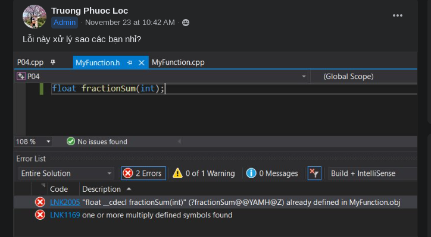

These are my personal thoughts. I just write them down and expand them into notes. ~~Please forgive me if I become aggressive at times.~~

I am open to all suggestions! If there is something you would like to add/correct (that is related to the course), please [message](https://www.facebook.com/12.despair)/[email](mailto:jalsol@protonmail.com) me. Thank you so much!

## A few words before the main content

We all start from nothing. We all make mistakes at some point. If you have been doing something wrong, change it. If you have no idea about something, learn about it.

If you see vulgar language from me on this blog, it's **most likely satire and there's no intention to hurt anyone**. That is how I am, this is my own place. Don't take it personally and interpret it as "shaming the newbies", because this place wouldn't have existed if that were the case.

## Variables naming

This is a **difficult and time-consuming** task. For real. You **cannot** just name your variables `a` or `b` or `z` or *some random bullshit from the alphabet like in Mathematics and Physics and whatever subjects there are*. Make the code explain itself.

```cpp
// Bad example
int fuck = 60; // minutes in an hour
int you = 60; // seconds in a minutes

bool shit = true; // print duration in seconds?

if (shit) {
    std::cout << 5 * fuck * you << '\n';
}
```

*What the fuck does this even mean? What exactly do `fuck`, `you`, and `shit` represent? What is that `5` doing over there? Not even the comments can save this shitshow.*

We can do better:

```cpp
// Good example
int minutes_per_hour = 60;
int seconds_per_minute = 60;
int duration_hours = 5;

bool print_duration_seconds = true;

if (print_duration_seconds) {
    int duration_seconds =
        duration_hours * minutes_per_hour * seconds_per_minute;

    std::cout << duration_seconds << '\n';
}
```

Now, this is a lot clearer. Variables now have **names with proper meanings**. You don't even need comments to explain anything, **the code just explains itself**. This is the effect of having good variable names.

I highly recommend you read/watch the references below to understand more.

References:

[Naming Things in Code](https://www.youtube.com/watch?v=-J3wNP6u5YU)

[1.7 - Keywords and naming identifiers](https://www.learncpp.com/cpp-tutorial/keywords-and-naming-identifiers/)

[Google C++ Style Guide](https://google.github.io/styleguide/cppguide.html#General_Naming_Rules)

## Character literals and string literals

### Character representation

This is an example from a classmate of mine:

```cpp
// What the fuck?
if (s[i] == 32) {
    // something
}
```

What does this `32` mean? Is it the number of bits of an `int` or something else?

In fact, it's actually the decimal representation of the space character (`' '`) on the ASCII table (since `s[i]` is a `char`).

My advice is to simply *use the motherfucking character, ffs.*

```cpp
// This is better
if (s[i] == ' ') {
    // something
}
```

The same should be applied to other characters as well. Use `'a'` instead of `97`. Use `'A'` instead of `65`. And so on.

### Use what you mean to use

Another example that can be seen from my classmates (even experienced ones):

```cpp
std::cout << first_value << " " << second_value << "\n";
```

Using `" "` instead of `' '` and `"\n"` instead of `'\n'` is **not** a good idea.

If you want to use a single character, use `' '` and not `" "`.

Imagine a scenario when you want to print one space, but then you accidentally type two spaces inside the quotes.

- `'  '` will return some *fuckery* value (or if you enable some warning options, the compiler can even tell you that you have multiple characters).
- `"  "` will return 2 spaces. And no one will ever tell you what will go wrong.

Even classmates with years of (competitive) programming make this mistake. So don't worry if you are new, it's actually easier to change that habit this soon.

## Coding styles


*I fucking love you all. That was a fun(ny) read.* *Reminded me of a certain "S" guy.*

*Please, for the love of god,* **follow a good coding convention** (maybe someone else's or create your own from the other good ones).

*A bad coding style will make everyone (including yourselves) question their very own existence, to the point of suicide. You fuckers will cause The Fifth Impact and kill every-fucking-body with your smelly codes.*

**Tech companies do have their own conventions** for different languages (and tools to format their codes to follow such conventions as well, like `clang-format`).

Here are some of the guides that I've found online:

- [The Core Guidelines](https://github.com/isocpp/CppCoreGuidelines) (a project led by Bjarne Stroustrup, the creator of C++)
- [LLVM](https://llvm.org/docs/CodingStandards.html)
- [Google](https://google.github.io/styleguide/cppguide.html) (my favorite, although there are minor stuff I don't like)
- [Chromium](https://chromium.googlesource.com/chromium/src/+/refs/heads/main/styleguide/styleguide.md)
- [Mozilla](https://firefox-source-docs.mozilla.org/code-quality/coding-style/index.html)
- [Webkit](https://webkit.org/code-style-guidelines/)
- [Microsoft](https://learn.microsoft.com/en-us/dotnet/fundamentals/code-analysis/code-style-rule-options?view=vs-2022)
- [GNU](https://www.gnu.org/prep/standards/standards.html) (tbh this one scares me, the ancient *standard* by boomers, like *wtf are those brackets*)

    
    
    No. Please, no.
    

**Do not try to go to an extreme**. Your codes should **look readable, not look cool**. If you ever see extreme examples, they are merely for demonstration purposes. *People will hate you if they cannot read your codes.*

## `using namespace std;`

*You are fucking mental if you use `using namespace std;`. It is goddamn evil and [it is forbidden by the core guidelines](https://isocpp.github.io/CppCoreGuidelines/CppCoreGuidelines#sf7-dont-write-using-namespace-at-global-scope-in-a-header-file).* **It defeats the whole purpose of namespaces.** *People will fucking hate you*. *This is not Competitive Programming.* The professors will not let you do this later in the curriculum. Get used to not using it while you can.

*(Actually, you can still use it, but you'll eventually have to stop and adapt to the new coding style without it. Change your habits sooner than later ig?)*

**For advanced readers:** There are some exceptions to this "rule", like `using namespace` inside a block. If a namespace is too long, consider namespace aliases. You can read more about `using` from the reference below.

Reference:

[6.12 - Using declarations and using directives](https://www.learncpp.com/cpp-tutorial/using-declarations-and-using-directives/)

## "Passing by value" vs. "Passing by reference"

Dr. Tien mentioned that "passing by reference" is faster. This is true for **many, but not all** cases. I had an argument, and the professor agreed, but some classmates did not pay attention (which made me sad).

Reference: 

[C++ Core Guidelines](https://isocpp.github.io/CppCoreGuidelines/CppCoreGuidelines#Rf-in)

To summarize, **"cheap-to-copy" data types should be copied,** which is better both performance-wise and safety-wise. **Others should be referenced**. 

A "cheap-to-copy" data type usually has a size of 2 or 3 words (which is 32 to 48 bits on 32-bit architectures, like `int`, `float`, or `char` for example). Examples of more complex data types are `std::vector` or `std::string`.

This is why `const int& x` does not make sense. Be aware of what you use and think about them.

## `#ifndef` guard for header files

Reference:

[C++ Core Guidelines](https://isocpp.github.io/CppCoreGuidelines/CppCoreGuidelines#sf8-use-include-guards-for-all-header-files)




Right, as if every freshman knows how to use a search engine properly. 

Many of you have the `MyFunction.h` file implemented like this:

```cpp
// MyFunction.h
void SomeFunc(char a[]);
```

This is indeed problematic. Here's an example.

If your code somehow includes `MyFunction.h` multiple times:

```cpp
// main.cpp
#include "MyFunction.h"
#include "MyFunction.h"

int main() {
    // something
}
```

Including a header file is basically copying the whole content of that file. So, after preprocessing, `main.cpp` will look like this:

```cpp
// main.cpp
void SomeFunc(char a[]);
void SomeFunc(char a[]); // duplicated

int main() {
    // something
}
```

`SomeFunc` is declared twice. You cannot declare a function exactly twice like this. This is where the `#ifndef` guard becomes useful.

```cpp
// MyFunction.h
#ifndef MY_FUNCTION_H
#define MY_FUNCTION_H

void SomeFunc(char a[]);

#endif // MY_FUNCTION_H
```

This is how it works:

- It checks whether there's any existing definition of `MY_FUNCTION_H`
- If it is **already defined** then it will **stop**, otherwise, continue
- Create the definition `MY_FUNCTION_H`
- Declare the function `SomeFunc`

With this, if a header file is included multiple times, only the first time counts.

Another alternative is `#pragma once`, but it is not standard and not portable (although major C++ compilers do support it).

```cpp
// MyFunction.h
#pragma once

void SomeFunc(char a[]);
```

~~My take is **just don't use it**. Others might have different opinions.~~ I now use it for my projects. There are some caveats here and there, but it's fine.

**Naming convention:** If your header file is `MyFunction.h`, **follow the *goddamn* file name** and name your definition `MY_FUNCTION_H`.

*Do not name it `toanthemcu`, `TOANTHEMCU`, or `TOAN_THEM_CU`, or other random stuff because you feel like it (Toan doesn't like this).*

*Well, maybe if your header file is `ToanThemCu.h` then `TOAN_THEM_CU_H` is a good choice.*

I don't strictly follow [Google](https://google.github.io/styleguide/cppguide.html#The__define_Guard)'s convention but it's good. Check that out.

## `<something.h>` vs. `<csomething>`

On the slides, header files such as `string.h` and `ctype.h` are included. Those are actually C header files. Not C++.

There are updated, standardized C++ versions of them.

- `string.h` → `cstring`
- `ctype.h` → `cctype`

You can see the pattern here. Replace `something.h` with `csomething`.

One thing to notice is that, since these are made to follow the C++ standard, functions like `strlen` are now implemented inside `namespace std`. So use `std::strlen` instead of `strlen` *(remember to use `std::` and not `using namespace std;`).*

## `<header>` vs. `"header"`

Reference:

[C++ Core Guidelines](https://isocpp.github.io/CppCoreGuidelines/CppCoreGuidelines#sf12-prefer-the-quoted-form-of-include-for-files-relative-to-the-including-file-and-the-angle-bracket-form-everywhere-else)

Quick one to answer. 

- `<header>` will try to look for `header` in the compiler's directories right away.
- `"header"` will look in **your local directory** first, then look in the compiler's directories.

Use `<>` for system headers and `""` for your stuff (including files you write and libraries you install as third parties).

## Using `strlen` inside a loop condition

```cpp
for (int i = 0; i < std::strlen(str); ++i) {
    // something
}
```

This is bad (*unless you don't give a fuck about performance*).

The condition is checked before every iteration. `std::strlen` will be **executed for every single check**. It will **run through the whole string** to get the size.

This means that you are repeatedly running through the whole string, again and again, while you know that its size will not change (or will have minor changes that you can easily control).

That is very inefficient. This is what I would do instead:

```cpp
int len = std::strlen(str);
for (int i = 0; i < len; ++i) {
    // something
}
```

`std::strlen` is run **once**. Its result is now stored in a variable called `len`.

Dr. Tien did mention that the compiler can optimize out `std::strlen`. However, apparently, [it's only true for string literals](https://stackoverflow.com/questions/50237841/is-strlen-optimized-out-for-string-literals) (strings with constant values), and that only applies to *some* compilers, not all of them. So watch out if you care about performance (which is not exactly something you should care about on CS161, but meh).

## `constexpr`

Some of you might remember seeing me using this. Now that you are probably introduced to `const`, I will talk a bit about `constexpr` as well.

**Note:** `constexpr` is available since C++11, so perhaps it's fine to skip this part for now.

Here's the thing: `const` is **not** truly constant.

The **only** "constant" thing about `const` is that it **disallows** **direct modification** of the value of the variable (however, with some *pointer magic fuckery*, you can work around this).

To have "true constants", C users use `#define` or `enum`. There are certain ups and downs of each method. You can find a ton of talks about these online (for [example](https://stackoverflow.com/questions/1674032/static-const-vs-define-vs-enum)).

However, since C++11, we C++ programmers will have `constexpr`.

- `constexpr` assigns the value at compile time (so it will take a bit of a while to compile) instead of run time, thus your program runs faster. `const` however assigns the value at run time (although the compiler can assign them at compile time if possible as a way to optimize your program, but still a hit-or-miss).
- `constexpr` will produce a symbol so you can look it up via a debugger (which won't work with `#define`).
- `constexpr` is more expressive than `enum` in many cases. `constexpr` is used to express some single values, while `enum` is used with a collection of values (*single-value-`enum`s are cringe and you can't say otherwise*).

There's also this `consteval` thingy but it's available since C++20, so I will not talk about it here.

## Global variables

Example:

```cpp
// main.cpp
#include <iostream>

int a;
float x;
bool nig[69420];

void f();

int main() {
    // something
}

void f() {
    // something
}
```

`a`, `x`, and `nig` are global variables. They are declared in the global scope. They are automatically initialized with their default values. They don't crash your stack size all of a sudden. They help you not write a long list of function arguments. *You are a competitive programmer.* And stuff.

Ok, that seems cool. **But it's actually a bad practice if you don't know what you are doing.**

- Every function can change such variables. Your functions will have a hard time trying to control when and how 'em variables update.
- They stay persistent in your program until it stops. It's a waste of memory if you only use them a few times.
- And other reasons I can't recall for now.

If you **really** need to use global variables, there are measures for that. This is actually a very debatable topic. You can look it up online. Those style guides provide some cool insights that you can learn from.

## `string[strlen(string)] == '\0'`

Dr. Tien mentioned this. This is a special thing about C-string.

Assuming the length of the string is `n`, then `string[n]` is `'\0'` (if the string is safely null-terminated). It is fine to access this element.

However, if the array is **not an array of char**, then it **will not be safe** anymore.

## Type of string literals

```cpp
void func(char str[]);

int main() {
    func("something"); // Failed

    // workaround
    char str[] = "something";
    func(str);
}
```

This leads to a compilation error. What's the reason behind this?

`"something"` actually has the type of `const char[10]`.

`10` is the size of our string, including the terminating null. However, what I would like to point out is the `const`. `"something"` is a constant value, so it's just intuitive that its type contains a `const`.

Since you can't really pass a `const char[]` to a `char[]` parameter, the compilation will fail. The fix is to make `str` in the parameter also a `const char[]`.

```cpp
// Notice it's now "const"
void func(const char str[]);

int main() {
    func("something"); // OK
}
```

You can, however, pass a `char[]` to a `const char[]` parameter. That means the above fix will still allow you to do something like this:

```cpp
// Notice it's now "const"
void func(const char str[]);

int main() {
    char str[] = "something";
    func(str); // OK
}
```

You may also notice there is a similar relationship with reference parameters (`int& a` vs. `const int& a`): adding a `const` allow you to pass literals as parameters.

```cpp
void funcRef(int& a);
void funcConstRef(const int& a);

int main() {
    funcRef(5); // Failed
    funcConstRef(5); // OK
}
```

Reference:

[String literal](https://en.cppreference.com/w/cpp/language/string_literal)

[https://stackoverflow.com/questions/15508148/what-is-the-type-of-a-string-literal-in-c](https://stackoverflow.com/questions/15508148/what-is-the-type-of-a-string-literal-in-c)

[What is the type of a string literal in C++?](https://stackoverflow.com/questions/15508148/what-is-the-type-of-a-string-literal-in-c)

## `istream::get` an empty line

A pretty good topic was brought up. `istream::get` is the way you are taught to read a line.

```cpp
char s[50];
std::cin.get(s, 50, '\n'); // First read
std::cin.ignore(10000000, '\n');
std::cin.get(s, 50, '\n'); // Second read
```

If we press Enter right at the first read, then the second read will be skipped altogether. Why does this happen?

Let's have a closer look at the [document of `istream::get`](https://en.cppreference.com/w/cpp/io/basic_istream/get), from overload (4) of the function:

> If no characters were extracted, calls `setstate(failbit)`.

This `failbit` state is the reason why the second read is not called.

`istream::clear()` can be used to solve it, but **I'd advise using `istream::getline` to read an actual line**.

```cpp
char s[50];
std::cin.getline(s, 50); // First read
std::cin.getline(s, 50); // Second read
```

Notice there is no `istream::ignore` between 2 reads. It is because **`istream::getline` reads the end-line character and then discards it**. `istream::get` will leave the end-line character in the buffer, so you would have to clear it manually.
