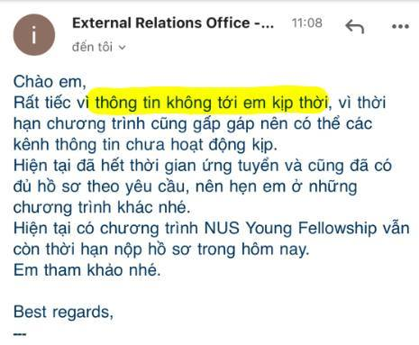

TL;DR: Quan điểm của mình: Dù không cấm, nhưng không nên cúng tiền để làm hồ sơ học trao đổi trên đại học vì:

- Dễ bị trường úp sọt (xem ảnh);
- Dễ xảy ra hệ lụy tiêu cực sau này.

---

Mình sống trên đời được 21 năm (sắp hẹo tới nơi, vừa mới đi khám ở Lão Khoa (!!) BV Quân Y 7a xong). Cũng đã đi trao đổi 1 (một) lần.

Nộp hồ sơ ứng cử học bổng, hồ sơ đi học trao đổi... mà viết luận thì bình thường. Nhưng lên Đại học rồi, làm hồ sơ đi học trao đổi mà vẫn phải tìm trung tâm, tìm mentor rồi trả phí để viết luận, xây dựng hồ sơ... thì chắc là lần đầu mình thấy. Mình cũng không thấy bạn bè mình trong/ngoài nước cúng tiền như vậy. Không ai cấm được các bạn cả thì các bạn cứ làm, chỉ là mình thấy buồn cười thôi.

Quái lạ là, tùy vào nơi bạn học (nhất là VNU và VNUHCM) mà có tỉ lệ phòng Quan hệ Đối ngoại/Công tác Sinh viên, v.v sẽ... bỏ quên mất lời mời của trường đối tác => hẹn gặp các bạn đợt sau. Vừa rồi, dù đã chuẩn bị hồ sơ rất kỹ nhưng các bạn mình ở khoa CNTT bị úp sọt vì không được thông báo.

Lúc duyệt hồ sơ thì trường của các bạn ở VN mới là trường đề cử các bạn đi, tới được trường bên kia thì các bạn chỉ cần phỏng vấn nữa là xong. Thậm chí, đợt mình nộp hồ sơ còn không bắt phải viết luận (nhưng mình vẫn viết mặc dù low effort hihi). Nó hơi khác so với việc nộp hồ sơ học chính quy, nơi các bạn dành vài năm (không phải 4 tháng). Mình thấy chi tiền cũng không đáng lắm.

Mình chỉ e ngại đúng một điều rằng: đã có lần đầu thì có thể sẽ có những lần sau. Các trung tâm, mentor quảng cáo học viên đậu những chương trình trao đổi. Thế là mọi người đều đổ xô xòe tiền cho họ, dẫu cho có nguy cơ bị trường úp sọt.

Thôi thì we are prestige now 😳😳😳😳😳
