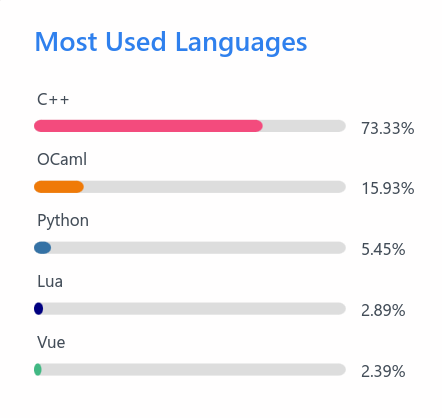

## Introduction

I first heard about Functional Programming (FP) in high school. I heard it was some cryptic, math-heavy
stuff (that scared people, myself included, away). But I also heard that learning FP would
open a new perspective of oneself on programming.

Nowadays, plenty of features from FP have made it to mainstream general-purpose programming
languages:

- Functions as values
- Higher-order functions
- Closures
- Partial function application
- Immutable data structures
- Pattern matching
- Algebraic data types
- Monads (yes, [people are starting to use monads in TypeScript](https://x.com/search?q=effectts))


## Haskell

I finally made my first attempt picking up FP in my freshman year. Haskell has been the most
widely known language in the paradigm, so it was natural that I started with it. I tried solving
some Project Euler problems to get myself started.

My problem with Haskell was that it could get a bit too cryptic, with too many features:
too many keywords and too many symbols to remember. I had had a bit of experience with C++
already, and I couldn't manage to fit another complex language in my brain.

> Although one can slightly understand the code below, there are too many things going on:
`readMaybe`, `do`, `mapM`, `$`, `<-`, `++`, etc.

```haskell
import Text.Read (readMaybe)
import System.Exit (die)

parse :: String -> IO Int
parse s = case readMaybe s of
  Just n  -> return n
  Nothing -> die $ "Invalid number: " ++ s

processNumbers :: [String] -> IO ()
processNumbers strs = do
  nums <- mapM parse strs
  let positives = filter (>0) nums
  if null positives then
    putStrLn "No positive numbers!"
  else
    let s = sum positives in
    case s of
      0 -> putStrLn "Sum is zero."
      s' | s' > 100 -> putStrLn $ "Big sum: " ++ show s'
         | otherwise -> putStrLn $ "Sum: " ++ show s'

main :: IO ()
main = processNumbers ["42", "-5", "60", "0", "5"]
```

Haskell is pretty strict about being purely functional, so it can get irritating to implement
stuff that would've been trivial and performant in the Imperative paradigm. Also, Haskell
(and its users) tends to surround itself with a lot of mathy buzzwords, especially from category
theory. This scares many people away, and I believe this does more harm than good to FP,
especially when Haskell is often the recommended language for FP.

## OCaml

It is often brought up alongside Haskell. OCaml came from the ML family, thus has both classic/traditional
and modern/pragmatic influences. It is much simpler than Haskell, doesn't tie itself to category
theory that often, and you can get productive pretty quickly.

> This OCaml uses a lot less features: no monads, only pattern matching; the `map` and `filter`
functions are accessed from the module `List`.

```ocaml
open Printf

let parse s =
  match int_of_string_opt s with
  | Some n -> n
  | None -> failwith (sprintf "Invalid number: %s\n" s)

let process_numbers strs =
  let nums = List.map parse strs in
  let positives = List.filter ((<) 0) nums in
  match positives with
  | [] ->
    print_endline "No positive numbers!"
  | _ ->
    let s = List.fold_left (+) 0 positives in
    match s with
    | 0 -> print_endline "Sum is zero."
    | s when s > 100 -> printf "Big sum: %d\n" s
    | s -> printf "Sum: %d\n" s

let () = process_numbers ["42"; "-5"; "60"; "0"; "5"]
```

It's also multiparadigm: you can write imperative, you can write OOP. You can have mutability
with ease (although immutability is the default).

I started with OCaml by writing an [MIPS assembler](https://github.com/jalsol/jalmas). I
used it in competitive programming (mostly on AtCoder) and [Advent of Code 2024](https://github.com/jalsol/aoc2024).
I wrote a [minimal chat application](https://github.com/jalsol/minichat) and a [redis clone](https://github.com/jalsol/jaldis)
in OCaml. I even convinced my Principles of Programming Languages teammates (who had no clue
about FP in the first place) to try OCaml,
[do a presentation about OCaml](https://docs.google.com/presentation/d/17BAgwsFivyZM_eT36Qh0WWqoYazT51iNYBTiD59cDBA/edit?usp=sharing),
and even [implement a small OCaml interpreter](https://github.com/smol-lang/smol) for the
course.



1 year with OCaml has quickly overtaken my 5 years of C++ development. [All of my new projects
since June 2024 are in OCaml](https://github.com/jalsol?tab=repositories).
The overall feedback from myself and my peers was positive.


OCaml is now my favorite language. 

*(jane street pls hire me)*

## Elixir

Around the same time that I discovered OCaml, I also considered Elixir and had a short stint
with it. Elixir also had a lot of hype, due to being a Ruby-like FP language that runs on
the BEAM VM, thus it's fault-tolerant and super scalable.

However, the major drawbacks for me are:

- It does not have a strong and static type system (it has a dynamic type system);
- It does not support imperative programming (can be critical for performance);
- It's not as versatile as OCaml or Haskell

I really wanted to love Elixir. Maybe at some point in the future.

## Scala

A FP big boy in the industry. I personally have heard of some local/regional businesses
that use Scala (like Grab an Anduin Transactions). Lichess is also a very astonishing one
for using Scala. It runs on the JVM, thus it can benefit from the very huge ecosystem and
interoperability with libraries and frameworks in Java, which makes it very appealing.

Some of my problem with Scala are:

- Very slow compile time;
- No Hindley-Milner type inference;
- Some features can get very ugly and unergonomic (e.g. currying, piping);
- The JVM creeping into "features" (why is there function vs. method).

## Clojure (or any Lisp variant, really)

The Lisp family is pretty much the original big gun in the FP world. There are many variants,
but the one that I tried to learn was Clojure (yet again, it running on the JVM is very appealing).

My biggest turn-off with Lisp is the S-expression itself. I tried to love it. I really did.
I understand its appeal. But it never clicked for me. The ordering and the excessive use
of parentheses just killed it. There's also the issue with the dynamic type system as well.
