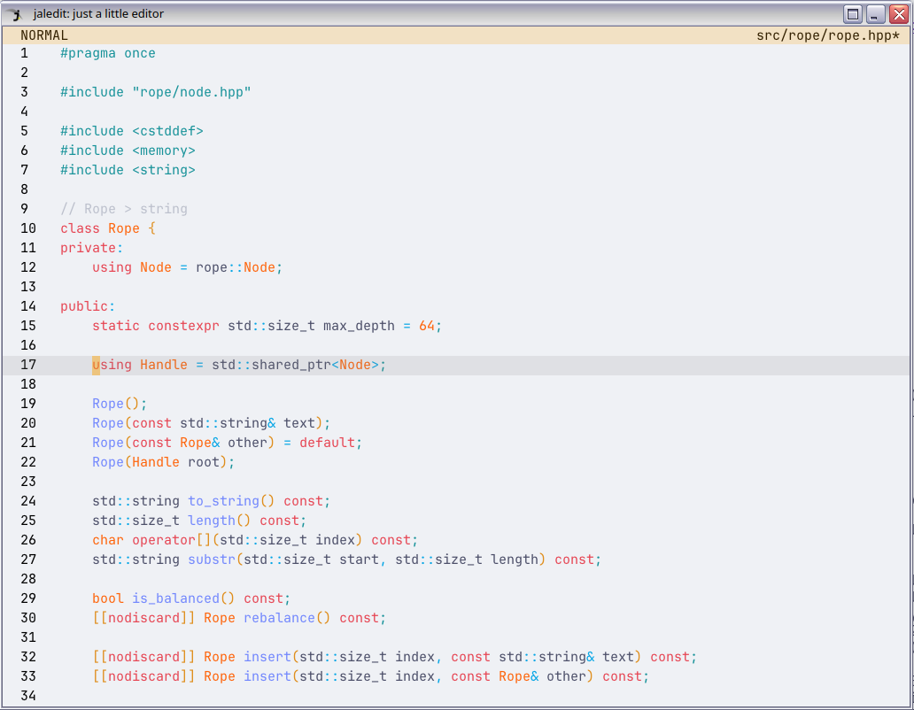
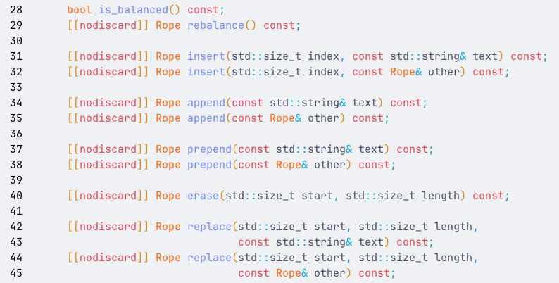

**NOTE**: This blog does not support TeX, so the TeX inline commands are all over the place. To see the submitted version, [click here](jaledit_report.pdf).

# Introduction

This is a source code text editor that focuses on performance. With the help of different data structures and algorithms, this editor offers **superior performance** over popular existing editors (Vim, Nano, Visual Studio Code, Sublime Text, …), as it enables efficient editing operations and manages huge files (that would otherwise crash or stall other editors).

# Features

- Fast editing operations (insertion and deletion, copy and paste, find and replace…);
- Autocompletion;
- Extensible syntax highlight;
- Vim-like navigation;
- Buffer management.

# Demonstration

- [using jaledit to solve programming problems](https://www.youtube.com/watch?v=DOiqO8f-9TY)
- [jaledit loads faster than other editors](https://www.youtube.com/watch?v=o27J9EdEBYo)

# Repository

[Here is the repository of the project on GitHub](https://github.com/jalsol/jaledit).

# Usage

jaledit is greatly inspired by Vim, one of my favorite text editors. Most features in jaledit are copied from Vim, including the keybindings and the functionalities, but with my own twists.

## Editor



This is the default view of jaledit.

At the top is the status bar.

- On the left of the status bar is the mode indicator (as jaledit, just like Vim, is a modal editor).
- On the right is the name of the file (or `"new file"` if it’s a new buffer). There is an asterisk next to the filename if there are unsaved changes.

On the left of the editor is the line number column.

The color scheme chosen for jaledit is [Catppuccin Latte](https://github.com/catppuccin/catppuccin). At the moment, jaledit does not support choosing another color scheme.

## Buffer Manager


This is the Buffer Manager.

Each line corresponds to a buffer entry. This allows switching between multiple buffers and lets you work on multiple files inside jaledit.

## Keybinding

### Normal mode

| Keybinding | Usage |
| --- | --- |
| h | Move the cursor to the left |
| j | Move the cursor down |
| k | Move the cursor up |
| l | Move the cursor to the right |
| gg | Move the cursor to the first line |
| G | Move the cursor to the last line |
| 0 | Move the cursor to the first column |
| $ | Move the cursor to the last column |
| w | Move the cursor to the next word |
| b | Move the cursor to the previous word |
| i | Enter Insert mode |
| v | Enter Visual mode |
| o | Move the cursor down, insert a new line, and enter Insert mode |
| O | Move the cursor up, insert a new line, and enter Insert mode |
| a | Move to the next column and enter Insert mode |
| A | Move past the last column and enter Insert mode |
| u | Undo |
| r | Redo |
| x | Cut the current character on the cursor |
| p | Paste |
| dd | Cut the current line |
| yy | Copy the current line |
| dw | Delete the current word on the cursor |
| cw | Delete the current word on the cursor and enter Insert mode |
| s | Save |
| S | Save as |
| f | Enter the Buffer Manager |
| F | Open a file |
| / | Find |
| ? | Replace |
| n | Move the cursor to the next occurrence found |
| N | Move the cursor to the previous occurrence found |

### Insert mode

| Keybinding | Usage |
| --- | --- |
| Esc | Return to Normal mode |
| Ctrl-n | Open the autocomplete box and choose the next suggestion |
| Ctrl-p | Open the autocomplete box and choose the previous suggestion |

### Visual mode

| Keybinding | Usage |
| --- | --- |
| Esc | Return to Normal mode |
| d | Cut the current selection |
| y | Copy the current selection |

### Buffer Manager

| Keybinding | Usage |
| --- | --- |
| Esc | Return to Normal mode |
| f | Return to Normal mode |
| d | Close the current buffer (if not dirty) |
| D | Force close the current buffer |
| n | Create a new buffer |

### Finder

| Keybinding | Usage |
| --- | --- |
| Esc | Return to Normal mode |
| Tab | Switch between "Find" input and "Replace" input |
| Enter | Find/Replace |

# Internal Implementation

There are 5 important modules implemented in the project:

- Rope
- Keybindings
- Autocompletion
- Syntax Highlight
- Finder

## Rope

### Introduction

Unsurprisingly, the most essential functionality of a text editor is the ability to edit text efficiently. The operations commonly used in a text editor usually include (but are not limited to):

- Insertion, deletion;
- Concatenation, split;
- Undo, redo.

Although these operations appear fairly simple and are often taken for granted in every text editing application, internal implementation to make them efficient is often less mentioned.

### "Keep It Simple, Stupid?"

For files that are about a few MBs, the best way to manage them is the simplest way (applying the KISS principle): treating the entire content of a file as a simple string. To insert a piece of text into the middle of the file:

- Split the string (which is the content of the file) into two parts;
- Move the latter part further back to create a gap for the inserted text (may require reallocation to extend memory);
- Insert the text into the gap.

The size of the L3 Cache on modern PC CPUs usually varies from 1 MB to 64MB (up to 256MB for server computers). This means that if the file is small enough to fit inside the L3 Cache, we can benefit from the very fast `memmove()` call, despite the $O(n)$ time complexity and $O(n)$ space complexity.

*This procedure is, in fact, a subroutine for Insertion Sort, which is known to have good performance on small arrays by utilizing the CPU Cache.*

### Handling larger files with Rope

To handle larger files that cannot fit inside a CPU Cache (for example, files that have hundreds of MBs or even some GBs), data structures are required. There are some options used by popular editors:

- Array of Lines: used by [Vim](https://github.com/vim/vim/blob/master/src/fileio.c#L1232-L1292);
- [Gap Buffer](https://en.wikipedia.org/wiki/Gap_buffer): used by [Emacs](https://www.gnu.org/software/emacs/manual/html_node/elisp/Buffer-Gap.html);
- [Piece Table](https://en.wikipedia.org/wiki/Piece_table): used by [Visual Studio Code](https://code.visualstudio.com/blogs/2018/03/23/text-buffer-reimplementation), [Microsoft Word](https://web.archive.org/web/20160308183811/http://1017.songtrellisopml.com/whatsbeenwroughtusingpiecetables).

Each of these data structures has its pros and cons. However, I was fascinated by [Rope](https://en.wikipedia.org/wiki/Rope_(data_structure)), a data structure that treats a large string as a concatenation of smaller substrings, connected by a tree structure. Rope is [claimed to be used by Sublime Text and Gmail](https://iq.opengenus.org/rope-data-structure/) (however, I didn’t find any other reliable sources to back up this claim).

Rope had been used in the past, but [the most well-known paper on the rope](https://citeseer.ist.psu.edu/viewdoc/download?doi=10.1.1.14.9450&rep=rep1&type=pdf) was published in December 1995, by Hans-J. Boehm, Russ Atkinson, and Michael Plass from Xerox.

### Underlying Structure of Rope

Rope is a balanced tree, where each leaf contains an immutable substring. The internal nodes are used to represent the concatenation of the substrings and may contain some special values for convenience.


A rope that represents the string `"Hello my name is Simon"`. Courtesy: [Wikipedia](https://en.wikipedia.org/wiki/Rope_(data_structure)#/media/File:Vector_Rope_example.svg).

Many different balanced trees can be used as the backbone of rope. Some examples like B-Tree or AVL Tree are mentioned in the paper. However, the paper also proposes another balancing condition as well, which will be used for implementation later.

### Rope Concatenation

Since the rope is a tree, the concatenation of two ropes is trivial:

- Create a new root node;
- Assign the left and right rope to the left and right child of that root node, respectively.


Concatenating `"Hello my "` and `"name i"`. Courtesy: [Wikipedia](https://en.wikipedia.org/wiki/Rope_(data_structure)#/media/File:Vector_Rope_concat.svg).

The time complexity of concatenation is $O(1)$ since the number of steps to concatenate is constant.

Concatenation also requires only one new node to connect the left and the right subtree. Thus, the space complexity is $O(1)$.

### Rope Split

There are 2 cases:

- The split point is at the end of the substring of a leaf;
- The split point is in the middle of the substring of a leaf.

The first case can be solved by the following procedure recursively:

- If the split point belongs to the left subtree, split the left subtree into two smaller subtrees at the split point;
- Denote the left and the right subtree of the left subtree as the "left-left" and the "left-right" subtrees, respectively;
- We know that:
    - The "left-left" subtree represents the first part of the rope;
    - The "left-right" subtree and the right subtree represent the second part of the rope;
- Thus, return the "left-left" subtree, and the concatenation of the "left-right" and the right subtree as a pair;
- If the split point belongs to the right subtree, we apply almost the same logic but on the other side.

The second case can be solved just like the first case, the only difference being that the split point is in the middle of the substring of the leaf node. In such a case: replace the leaf node with two new leaf nodes, each containing its respective half of the substring.

The time complexity of splitting the rope is $O(\log n)$. The traversal goes as far as the depth of the tree.

The space complexity is $O(\log n)$ since concatenation may happen at each level of the tree.

If leaf splitting is performed, the extra time complexity for creating new leaves may be added (although in practice this can be very fast because the substring is small enough). Some implementations may even try to share resources, eliminating the cost of creating any new strings at all.


Splitting `"Hello my name is Simon"` into `"Hello my na"` and `"me is Simon"`. Courtesy: [Wikipedia](https://en.wikipedia.org/wiki/Rope_(data_structure)#/media/File:Vector_Rope_split.svg).

### Rope Insertion

Insertion can be implemented using Concatenation and Split.

To insert a string into the rope at position $i$:

- Convert the input string into the input rope;
- Split the original rope at position $i$;
- Concatenate the first part of the split, the input rope, and the second part of the split together.

The complexity of Insertion is the total complexity of one Split and two Concatenations, which is $O(\log n)$ time and $O(\log n)$ space.

### Rope Deletion

Just like Insertion, Deletion can also be implemented using Concatenation and Split.

To delete the characters with the indices in the range $[a;b]$:

- Split the original rope at position $a$ to get the left and the right subtree;
- Split the right subtree at position $b$ to get the "right-left" and "right-right" subtrees;
- Concatenate the left subtree and the "right-right" subtree.

The complexity of Deletion is the total complexity of two Splits and one Concatenation, which is $O(\log n)$ time and $O(\log n)$ space.

### Rope Rebalancing

Rope is a tree. Like any other search tree, the rope has to be balanced to achieve efficiency for all operations.

A rope may be implemented using any existing balanced trees, such as the B-tree and the AVL tree as mentioned in the paper. There’s another simpler method used for rebalancing the rope that is featured in the paper.

We define the depth of a tree as the maximum depth of the left and the right subtree plus one. The depth of a leaf node is $0$.

Let $F(n)$ be the $n$-th Fibonacci number. The rope of depth $n$ is considered balanced if the length of the string it represents is at least $F(n+2)$. *Please note that a balanced rope may contain unbalanced sub ropes.*

The procedure to rebalance the rope is to simply rebuild the rope in a specific way. Since it is not easy to summarize the steps, I advise reading the paper itself to learn more.

Because the time complexity for rebuilding the rope is $O(n)$, it is suggested that the rebalancing only occurs selectively, or when a threshold is reached that violates the balanced condition.

### Notable Implementation Details

Rope was part of the [SGI STL](https://web.archive.org/web/20070628221742/http://www.sgi.com/tech/stl/ropeimpl.html). Nowadays, it is still included as part of the [Extension headers of the GNU C++ Library](https://gcc.gnu.org/onlinedocs/libstdc++/manual/ext_sgi.html) (although it’s abandoned) and was never standardized as part of the C++ Standard Library. My [implementation of the rope](https://github.com/jalsol/jaledit/tree/cpp-reimpl/src/rope) features some notable additional implementation details that differ from that of the SGI STL.

There are different ways to implement the Undo/Redo operations. The easiest is to create a carbon copy of the current string to a stack before it is mutated. However, this requires a lot of memory, and since the target is to load a file that’s a few hundred MBs large, this is inherently insufficient.

Another method is to only store the parts that are about to be changed in the stack, and not the entire string. I find this difficult to implement well.

One idea that I found is Immutable Data Structures. I am greatly inspired by [JuanPe’s talk at CppCon 2017](https://www.youtube.com/watch?v=sPhpelUfu8Q), where he talked about using a Relaxed Radix Balanced Tree to create a "flex vector", an immutable data structure. Immutable Data Structures are very important in the Functional Programming paradigm, where objects are immutable to not cause any side effects. They save memory by sharing common resources between their different versions

The property of immutability already exists in some parts of the rope, namely the substrings that the leaves hold. I simply apply the same idea for the internal nodes, using `std::shared_ptr` in C++, which is a built-in smart pointer type with a reference counter. `std::shared_ptr` keeps track of how many references to the address there are, and it will free the memory if and only if the reference counter drops to $0$.

Most of the resources are shared between different versions, and only a few nodes from the root to the updated leaves are updated. This makes implementing the Undo/Redo operations incredibly easy: our stack now contains actual Rope objects and neither carbon copies nor detached pieces of information.



These functions return new Ropes that should not be discarded. The source code is viewed inside jaledit.

## Keybindings

### Introduction

Each sequence of keys is mapped to a function. Hence, to quickly match the input command to the desired function, a Trie is used.


An example of a Trie with the commands `di{`, `di(`, `dd`, and `dw`. Each leaf (which represents a complete string) will be mapped to a function.

### Implementation

```cpp
class Keybind {
public:
    Keybind();
    ~Keybind();

    template<std::invocable Func>
    void insert(std::string_view keyseq,
                Func func,
                bool editable);

    void step(char c, bool editable);
    void reset_step();

private:
    using Node = keybind::Node;

    Node* m_root{new Node};
    Node* m_current{};
};
```

```cpp
namespace keybind {

class Node {
public:
    void set_parent(Node* parent);
    Node*& parent();

    using ChildArr =
        std::array<Node*, constants::char_limit>;

    ChildArr& children();
    const ChildArr& children() const;

    Node*& child(char c);
    virtual void call(bool _) { (void)_; };

    virtual bool is_func() { return false; };
    virtual ~Node();

protected:
    Node* m_parent{};
    ChildArr m_children{};
};

template<std::invocable Func>
class FuncNode : public Node {
public:
    FuncNode(Func func, bool editable);
    void call(bool editable) override;

    bool is_func() override { return true; }

private:
    Func m_func;
    bool m_editable;
};

} // namespace keybind
```

## Autocompletion

### Introduction

Initially, when coming up with ideas for this project, I intended to also use the Trie for prefix matching. However, an observable property of modern editors is that they do not perform strict prefix matching. You can make a typo, and the autocomplete engine will still suggest the most suitable keywords.

This requires an **Approximate String Matching algorithm**. This has been a popular topic, as it is required to solve many problems from different fields, including (but not limited to):

- Matching of nucleotide sequences from DNA data;
- Spam filtering;
- Plagiarism and copyright infringement detection.

### The Smith-Waterman Algorithm

There are many CLI tools for filtering (GNU grep, Fuzzy Finder, Ugrep, Ripgrep, The Silver Searcher…) as well. The algorithm that I choose for autocompletion is the **Smith-Waterman algorithm**, inspired by Fuzzy Finder, one of my favorite tools.

The Smith-Waterman algorithm performs local sequence alignment to match as many local sequences as possible. This allows more flexibility and fewer penalties for typos, using custom scoring criteria.

The algorithm to match 2 strings $a$ and $b$ consists of these steps:

1. Set the scoring:
    1. $s(c_1,c_2)$  is the similarity score.
        
        For jaledit, $s(c_1,c_2)=\begin{cases}
        16\text{ (if }c_1=c_2)\\
        -128\text{ (otherwise})
        \end{cases}$
        
    2. $W_k$ is the score if the length of the ignored gap is $k$. For jaledit, $W_1=64$.
2. Initialize a matrix $H$ of size $(|a|+1)\times(|b|+1)$, filled with 0.
3. Fill the matrix with the following formula:
    
    $H_{ij}=\max\begin{cases}
    H_{i-1,j-1}+s(a_i,b_j)\\
    H_{i-k,j}-W_k\\
    H_{i,j-l}-W_l\\
    0
    \end{cases}$
    
4. The final score is $\max H_{ij}$.

Keywords with the highest scores will be presented to the user.

Both the time and space complexity of this algorithm is $O(nm)$. However, the length of the input pattern is usually small, so this algorithm is acceptable.

### Implementation

```cpp
int Suggester::calc_score(const std::string& keyword,
                          const std::string& pattern) {
    // Smith-Waterman algorithm

    constexpr int match = 16;
    constexpr int mismatch = -128;
    constexpr int gap = -64;

    int max_score = 0;

    std::vector matrix(pattern.size() + 1,
                       std::vector(keyword.size() + 1, 0));

    for (std::size_t i = 1; i <= pattern.size(); ++i) {
        for (std::size_t j = 1; j <= keyword.size(); ++j) {
            int match_score
                = pattern[i - 1] == keyword[j - 1]
                ? match
                : mismatch;

            matrix[i][j]
                = std::max({
                    matrix[i - 1][j - 1] + match_score,
                    matrix[i - 1][j] + gap,
                    matrix[i][j - 1] + gap,
                    0
                });

            max_score = std::max(max_score, matrix[i][j]);
        }
    }

    return max_score;
}
```

## Syntax highlight

### Introduction

The most common way to perform syntax highlighting is by performing a **lexical analysis**. This means that we are converting the source code into categories of meaningful lexical tokens. For programming languages, the categories include identifiers, operators, grouping symbols, and data types.

Lexical analysis is also the first step of compiling a source code into an executable. The program used to perform the lexical analysis is called a "Lexer". There are many lexer generators used by huge projects, but for practice purposes, I decided to implement my own lexer manually.

```cpp
enum class TokenKind : std::size_t {
    End,
    Invalid,
    Preproc,
    Symbol,
    OpenParen,
    CloseParen,
    OpenCurly,
    CloseCurly,
    OpenSquare,
    CloseSquare,
    OpenAttr,
    CloseAttr,
    Semicolon,
    Keyword,
    Comment,
    String,
    Char,
    Type,
    Number,
    Function,
    Operator,
};
```

```cpp
class Lexer {
public:
    Lexer(std::string_view text);
    Token next();

private:
    std::string_view m_text;
    std::size_t m_pos{};

    bool starts_with(std::string_view prefix) const;
    void skip(std::size_t n);
    void trim_left();
};
```

### Parsing?

For better analysis of the grammar structure of a language, parsing is often done to convert the lexed tokens into a tree structure. However, the targeted language for syntax highlight demonstration, C++, is an extremely tricky language to perform parsing, as its grammar is highly contextual and requires a lot of look-ahead. In the end, I chose not to do the parsing.

### Coloring

A benefit of not performing parsing is that there is no need to analyze the whole file. Lexical analysis can be done on each line, so only visible lines are analyzed and colored.

Each type of token is assigned to a color. jaledit currently supports 41 literal tokens, 14 data type tokens, and 84 C++ keywords.

```cpp
constexpr
std::array<Color, constants::token_count> kind_colors = {{
    {0, 0, 0, 0},        // End
    {76, 79, 105, 255},  // Invalid
    {23, 146, 153, 255}, // Preproc
    {76, 79, 105, 255},  // Symbol

    {223, 142, 29, 255}, // OpenParen
    {223, 142, 29, 255}, // CloseParen

    {223, 142, 29, 255}, // OpenCurly
    {223, 142, 29, 255}, // CloseCurly

    {223, 142, 29, 255}, // OpenSquare
    {223, 142, 29, 255}, // CloseSquare

    {223, 142, 29, 255}, // OpenAttr
    {223, 142, 29, 255}, // CloseAttr

    {23, 146, 153, 255}, // Semicolon

    {230, 69, 83, 255},   // Keyword
    {188, 192, 204, 255}, // Comment
    {64, 160, 43, 255},   // String
    {64, 160, 43, 255},   // Char
    {254, 100, 11, 255},  // Type
    {254, 100, 11, 255},  // Number
    {114, 135, 253, 255}, // Function
    {4, 165, 229, 255},   // Operator
}};
```

## Finder

There are many algorithms to find all occurrences of a substring in a large string. I personally use the Z algorithm, since it is easier to understand and easier to implement.

### Introduction

We have a string $s=s_0..s_{n-1}$. We define $z[i]$ as the longest common prefix of $s$ and $s_i..s_{n-1}$ (which is the suffix of $s$ starting from index $i$).

$s_0$ is not well-defined by the algorithm. We can let:

$s_0=\begin{cases}
n\text{ (if comparing } s \text{ with itself is allowed)}\\
0\text{ (otherwise)}
\end{cases}$

The implementation of jaledit defines $s_0=0$.

For example, considering `"aaabaab"`:

- $z_0 = 0$
- $z_1 = 2$ (longest common prefix of `"aaabaab"` and `"aabaab"` is `"aa"`)
- $z_2 = 1$ (longest common prefix of `"aaabaab"` and `"abaab"` is `"a"`)
- $z_3 = 0$ (longest common prefix of `"aaabaab"` and `"baab"` is `""`)
- $z_4 = 2$ (longest common prefix of `"aaabaab"` and `"aab"` is `"aa"`)
- $z_5 = 1$ (longest common prefix of `"aaabaab"` and `"ab"` is `"a"`)
- $z_5 = 0$ (longest common prefix of `"aaabaab"` and `"b"` is `""`)

Hence, $z=[0,2,1,0,2,1,0]$.

### Implementation

This is the trivial $O(n^2)$ implementation:

```cpp
int n = s.size();
std::vector<int> z(n);

for (int i = 1; i < n; i++) {
    while (i + z[i] < n && s[z[i]] == s[i + z[i]]) {
            ++z[i];
    }
}
```

It can be seen from the above example that there are some repeating longest common prefixes, as we consider matching each suffix of $s$ in each step.

We define a **segment match** as any substring that is equal to any prefix of $s$. We also keep track of the **rightmost segment match** by keeping track of the range $[l, r)$ corresponding to it.

When calculating $z[i]$, there are some scenarios:

- $i \geq r$ (the index is outside the segment match): proceed with the trivial implementation method, update $r$ if needed;
- $i<r$ (the index is inside the segment match): it can be figured out that $s_l..s_{r-1}$ and $s_0..s_{r-l-1}$ are already matching, we can assign
    
    $z_i=\min\begin{cases}
    z_{i-l}\\
    r-i \text{ (in case }i+z_{i-l}\geq n\text{)}
    \end{cases}$
    
    then proceeds with the trivial algorithm and updates $r$ if needed.
    

```cpp
std::size_t z_length = z_text.length();
std::vector<std::size_t> z(z_length, 0);
std::size_t l = 0, r = 0;

for (std::size_t i = 1; i < z_length; i++) {
    if (i < r) {
        z[i] = std::min(r - i, z[i - l]);
    }
    while (i + z[i] < z_length && z_text[z[i]] == z_text[i + z[i]]) {
        ++z[i];
    }
    if (i + z[i] > r) {
        l = i;
        r = i + z[i];
    }
}
```

It can be proved that the time complexity for this algorithm is $O(n)$.

### Finding a string in the file

Let $z\_text=pattern+\diamond+content$. $\diamond$ can be any character that is guaranteed to not appear in both the pattern and the content, as it acts as a separator. Then, perform the Z algorithm on $z\_text$.

For each index $i$ from $|pattern|+1$ (we are skipping the pattern and the separator in $z\_text$), if $z_i=|pattern|$, then $content_{i-(|pattern|+1)}$ is the beginning of a match.

# Rejected Experiments

These are the earlier experiments of the project that did not make it to the final submission. The implementation for these experiments can be found in the `devel-piece-table` branch of the repository.

## C

In the early stages, the project was written in C to push the boundaries of performance and increase the difficulty of implementation. C was a good language, and this project might have ended up becoming a C project.

However, as the project got more complex, it became tricky to continue the development with C. Due to the lack of modern features and the lack of time, the project had to switch back to C++.

## Piece Table/Piece Tree

Many articles suggested that the Piece Table (or its upgrade, Piece Tree) is the absolute best data structure for text editors.

However, one big problem with the Piece Table is the $O(n)$ time complexity to access at an arbitrary position in the file, due to the use of a Linked List to link the pieces of text. The Piece Tree fixes this problem by leveraging the tree model, allowing $O(\log n)$ access, but implementing efficient Undo/Redo becomes a problem that even Visual Studio Code used to have. The perfect "Piece Tree" is too complicated to implement, given the short development time of the project.

I tried the Piece Table. To most people, the cursor movement speed may be negligible for small files. But for a long-time Vim user, the delay was immediately noticeable. After switching to another data structure, the cursor movement speed of jaledit became much faster, even beating Visual Studio Code.
