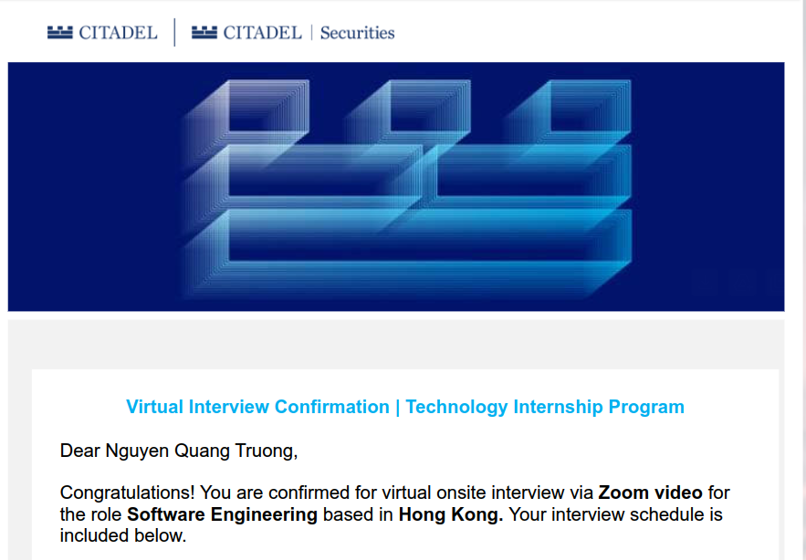

giờ này chắc hơi trễ để làm vlog, nên thôi chuyển sang dạng chữ vậy.

đây là một ngày cực kì bình thường (chắc chắn là không hề bị áp lực) của tôi (ranh con thất nghiệp năm thứ 3) ở Tân Gia Ba (tôi sắp sửa bị trục xuất):

- sáng mở mắt, đánh răng rửa mặt thì thấy incoming intern @ JPMorgan Chase
- đi ra nhà ăn với một thằng đang là manager của cty nó
- ăn sáng với 1 APMO medalist
- đi học chung lớp với 1 cựu leo núi và 1 WF medalist
- cuốc bộ sang lớp tiếp theo thì gặp 1 WF medalist khác
- sang lớp khác ngồi cạnh 1 chủ tịch của clb cấp trường (tên clb có tên 1 cty), 1 devops bro với full time job, và 1 co-founder của 1 cty
- đi ăn trưa chill chill thì gặp IOI/APIO medalist/TST đang đứng order
- sang lớp khác ngồi chung với một rổ IMO/IOI... medalist
- xế chiều đi cúp học với 1 bạn intern (sắp fulltime) @ Deloitte, và 1 thằng có podcast từ cấp 3 (hay feature người nổi tiếng ở 🇮🇳)
- đi mua nước ở ktx đối diện thì gặp WF finalist/APIO medalist/IMO medalist (tùy thời điểm)
- ăn tối với 1 co-founder kiêm CTO của 1 cty
- tối làm bài với mấy thằng trong dean's list
- họp nhóm project với 1 cựu leo núi và 1 IMO medalist
- được phát đồ ăn nhẹ thì gặp em trai của IPhO medalist/đỏ CF
- tối nhắn tin với 1 APIO medalist và mấy bạn du học sinh người Việt ở các nước khác
- đánh liên minh/đọc truyện/đọc confession/đọc rejection letter/đọc visa requirement trong nước mắt
- đánh răng, rửa mặt, đếm ngày bị trục xuất, đi ngủ

{{hr()}}

khi về nước, tôi đã ôm theo bên mình 2 cái bánh xe bò to nhất cuộc đời đến giờ (đã được phỏng vấn onsite cho vị trí SWE intern @ [Jane Street](https://www.janestreet.com/) & [Citadel Securities](https://www.citadelsecurities.com/), đủ tất cả các phần có thể phỏng vấn được nhưng đều tạch).

