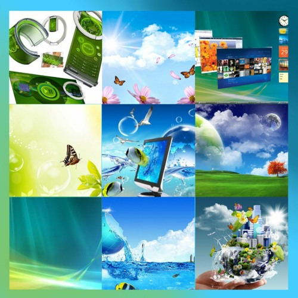

I'm by no means a graphics designer. This is how I feel as an average person, and you are about to read an average take.

I grew up in the 2007-2013 era of technology. The major design aesthetics then, is later coined "Frutiger Aero". That truly felt like "the future" (and it still does, really). The bright, glossy, and glassy textures, with the combination of technology and nature, just seem to work. It's perhaps not too far-fetched to say that this was how people imagined "utopia" to look like.

Then, came the era of "flat design". I was obsessed with digital minimalism at that time. And so, I happened to accept that design naturally. "No bullshit on my computer" became something I took pride in. Everyone was "stuck" with their "bloated-looking" skeuomorphic design. I felt superior like a kid with a green-on-black terminal pretending to be a hacker. I loved it.

However, after almost a decade(!) after my initial exposure to flat design, the simplicity became boring. Something was missing. And when I least expected it, a random midnight Youtube recommendation led me back to the good old days. The design now has its own name. A lot of people have also come back to it recently. They share Frutiger Aero images that they randomly find. They all thrive for the reminiscence of once "utopia" that did not happen. So do I. Daily driving Kubuntu on my newer machine, complex theme rendering is not a problem anymore. ~~The theme I am using is based on KDE Oxygen~~ I now use a [Windows 7-like theme on KDE](https://gitgud.io/wackyideas/aerothemeplasma).

Tech companies have realized this. Apple and Microsoft are now bringing a new design concept to the limelight: neumorphism. It's the fusion of the sleek flat design and the soulful skeuomorphism. Apple has been doing this since 2020. Windows 11 redesign is also a clear example. It's coming full circle.

One more thing: I dearly miss Windows 7 - the most beautiful and least intrusive OS. I wish I could live in that time once again.

{{hr()}}

Windows XP was the first OS I've ever used, probably since 3-4 years old. My love for computers started with those RegEdit magic tricks on Windows XP from a book I found at a local bookstore.

However, aesthetics wise, Windows XP doesn't have the "utopian" feel that Windows 7 has. It was still kind of flat. Not the overly simplified kind of the modern days, but of the Y2K era. One of the changes in Windows Longhorn was the bright and glossy textures. Then skeuomorphism came to the reworked Longhorn, all the way to Vista and 7, and everything turned even more lively.

XP was one great hell of a time. I just don't miss it as much as 7.
